# CodeTutor Agent

> AI 编程导师，不是 OJ。
> 具备"自主出题 → 执行判题 → 渐进辅导 → 轨迹分析 → 长期画像"完整认知循环的 **Agent 级**刷题系统。


---

## 为什么不是又一个 LeetCode Clone

传统 OJ 的逻辑是线性的：`用户提交 → 跑用例 → 对答案 → 结束`。
CodeTutor Agent 的逻辑是 ：能够根据用户个人的情况出题，知道能够帮助用户分析在写解题过程中出现的卡壳问题、分析思考过程，给出专家级的指导和提升意见。并记录用户画像。做到一个真正的代码编程导师。

几个真正"Agent 级"的差异点：

- **出题 Agent 自验证闭环**：题是自己出的，参考解是自己写的，测试用例是自己跑的——发现自己参考解跑不过某个用例，回去修题目描述歧义，再跑，全绿才交付。**盲信 LLM 的反面。**
- **判题 Agent 执行 + 温暖反馈**：用户代码提交后由 Judge0 沙箱跑全量测试用例，再由 LLM 解读结果，给出**温暖、面试导向**的反馈与修复建议；AC 时还会做时空复杂度分析与优化方向提示。verdict 永远以执行引擎客观结果为准，LLM 只负责文案，不臆造失败输出。
- **🔥 辅导 Agent 渐进提示 + 误解诊断**：不是 "WA at #3"，而是结合**编辑轨迹（edit-trace）**与最终代码，反推用户的思考路径与卡点，按 L0~L4 渐进给提示。
- **规划 Agent 长期画像驱动选题**：跨会话维护 **per-tag 知识点画像**（熟练度 ELO / 稳定性 / 遗忘）+ **6 维错误模式画像**，下一题不是随机出，而是选"最该练"的薄弱点。
- **评审 Agent 旁路守门**：对辅导输出做代码泄露过滤（低提示等级下不展示完整代码）与挫败情绪检测，纯旁路监听，不干预主流程。

---

## 功能演示

> 以下截图来自系统真实运行界面，存放于 [`demo/`](demo/) 目录。

### 出题 & 选题

| 出题主页面 | 选题 |
| --- | --- |
| 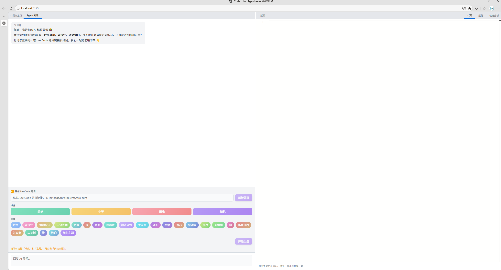 | 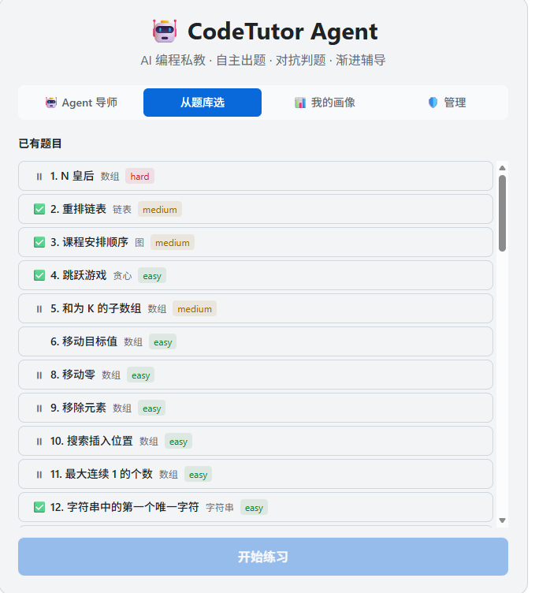 |

- **出题主页面**：AI 自主出题 + 自验证闭环（双解 + 示例 → 结构/编译/无思维链泄露校验 → 本地沙箱跑参考解全绿才交付），并展示题面、参考解与测试用例。
- **选题**：规划 Agent 依据用户画像（最弱知识点 / 错误模式）智能选题，而非随机出题。

### 出题子流程

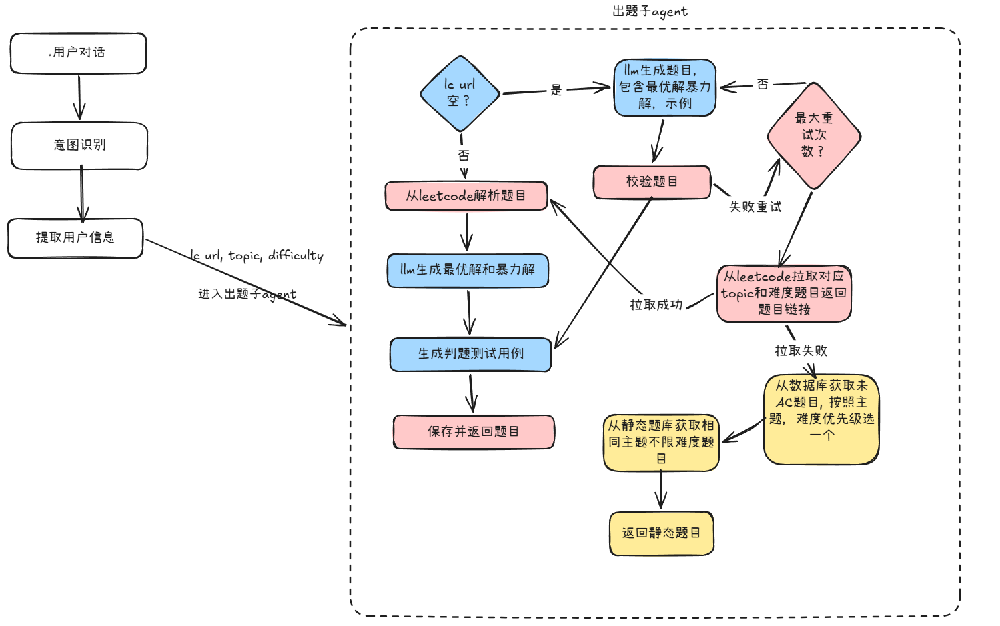

> 出题 Agent 的决策树：原创 LLM 生成（双解 + 示例）→ verify 结构 / 编译 / 无思维链泄露 → 本地沙箱跑参考解全绿才交付；未命中则回退 LeetCode 按主题拉题 → 历史未 AC 题 → 静态题库兜底。

### 做题 & 导师辅导

| 做题主页面 | 导师引导 |
| --- | --- |
| 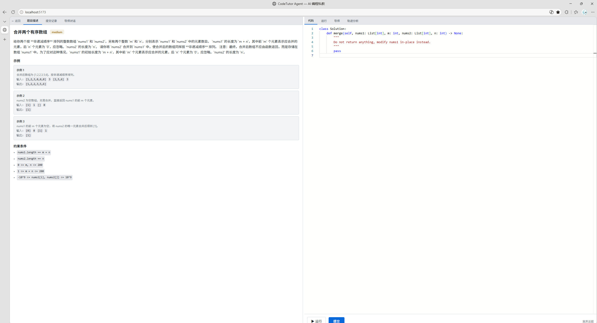 | 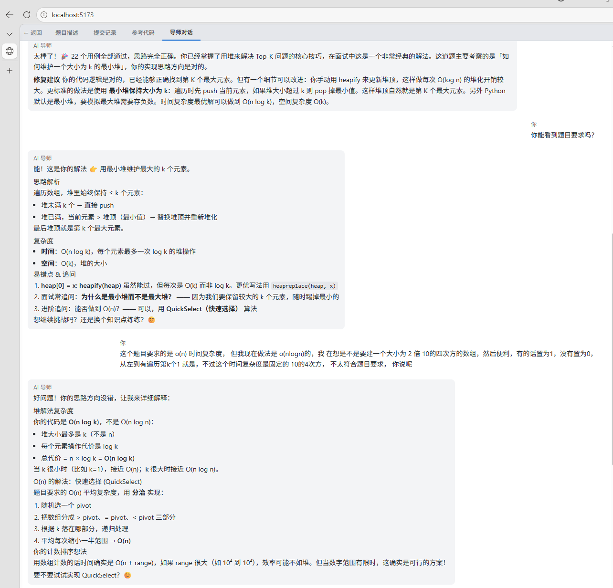 |

- **做题主页面**：内置 Monaco 在线代码编辑器，提交后走「Judge0 判题 → LLM 温暖反馈 → 下一轮」闭环。
- **导师引导**：渐进式提示 + 误解诊断；辅导 Agent 同时消费编辑轨迹与最终代码，动态给提示。

### 🔥 链路追踪辅导（核心亮点）

| 轨迹分析 | 导师与轨迹分析同屏 |
| --- | --- |
| 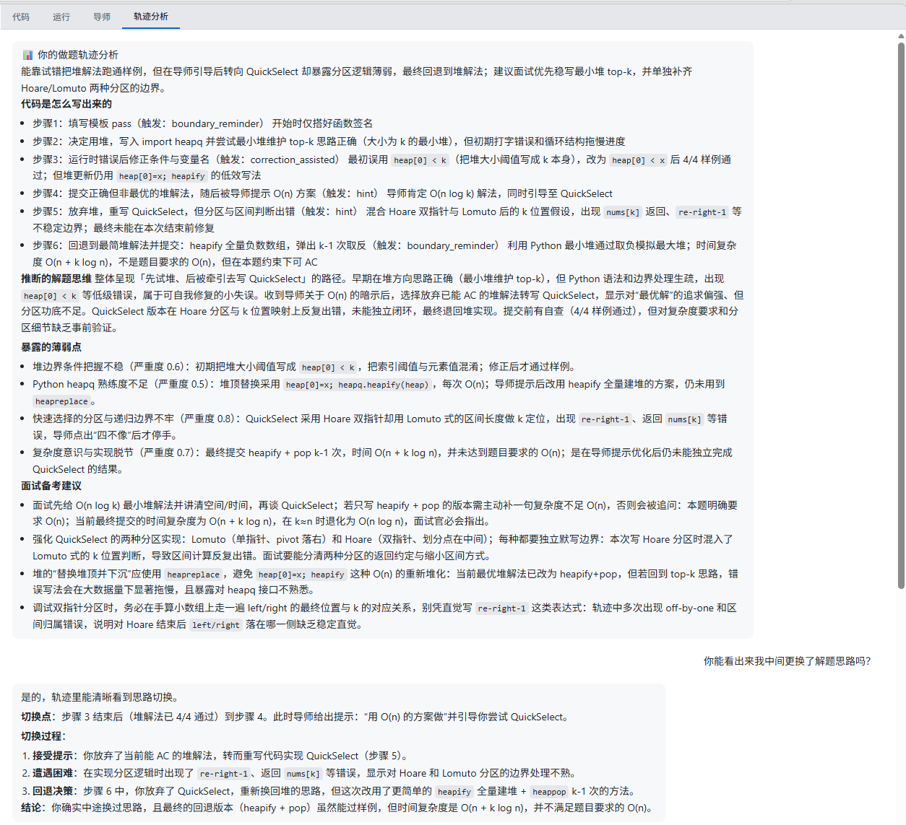 | 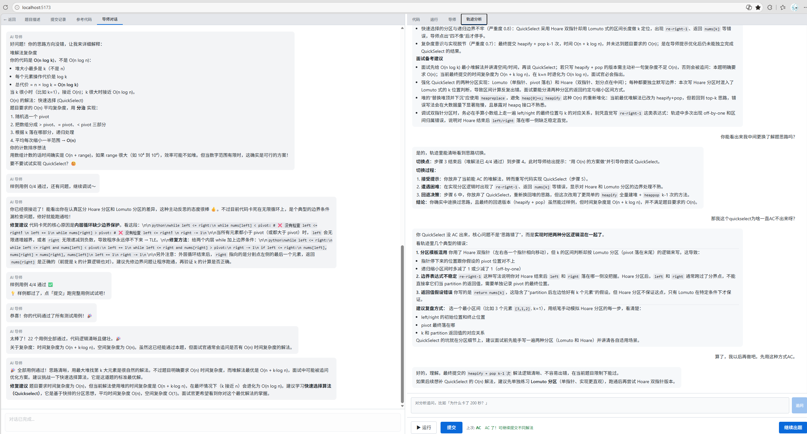 |

- **轨迹分析**：全流程采集用户的**编辑轨迹（edit-trace）**——每一次键入(edit)/停顿(idle)/运行(run)/提交(submit) 四类结构化事件都入轨，由 Agent 做轨迹分析（edit-trace analysis / summarize），反推真实思考路径与卡点，把"为什么卡住"变成可观测数据。
- **导师与轨迹分析同屏**：导师辅导界面与轨迹分析**联动展示**，提示等级（L0~L4）结合轨迹证据与提示依赖度动态推进，而非凭空给，能精准区分"不会用哈希表"还是"知道但写不对 dict"。

### 用户画像（六维错误模式 + 知识点画像）& 成本中心

| 我的画像 | 用户画像 | 用户画像 2 | 成本中心 |
| --- | --- | --- | --- |
| 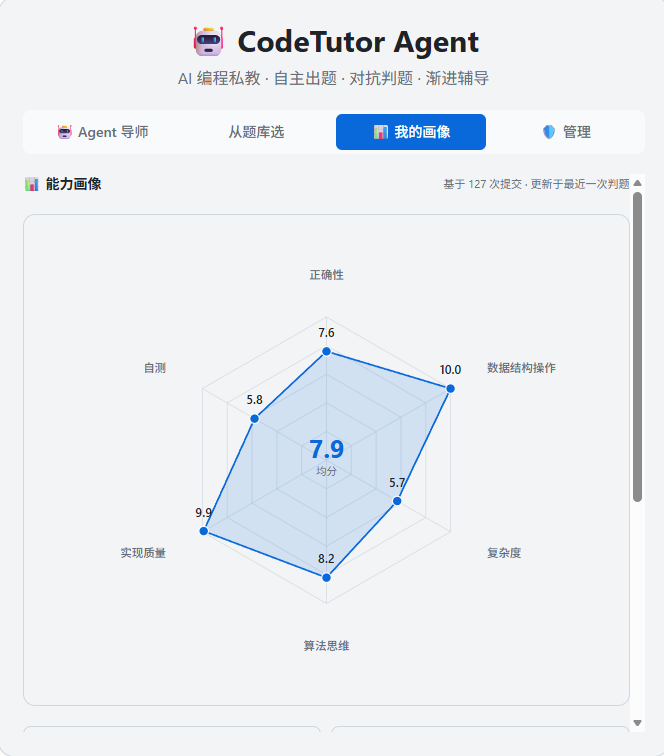 | 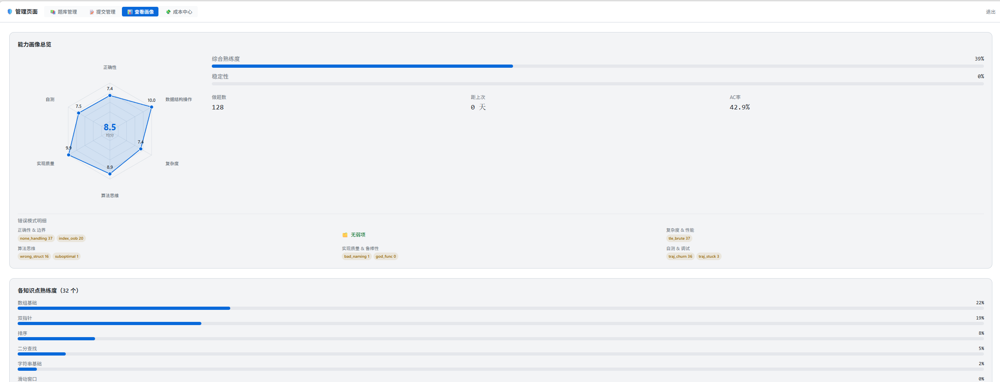 | 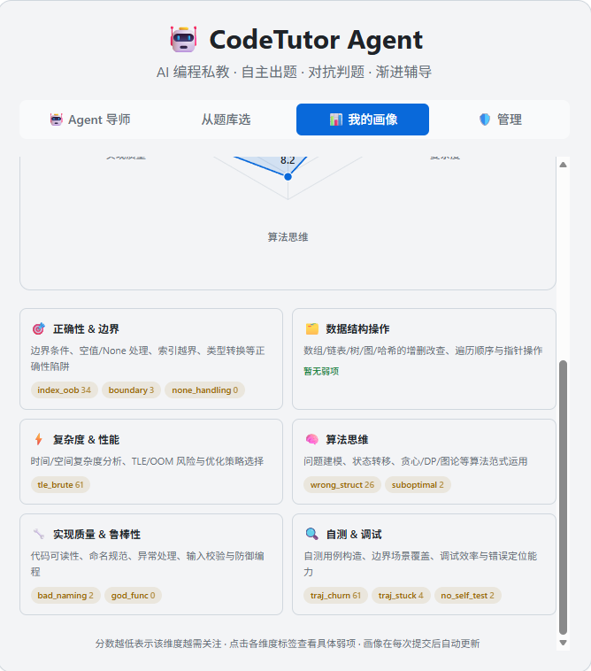 | 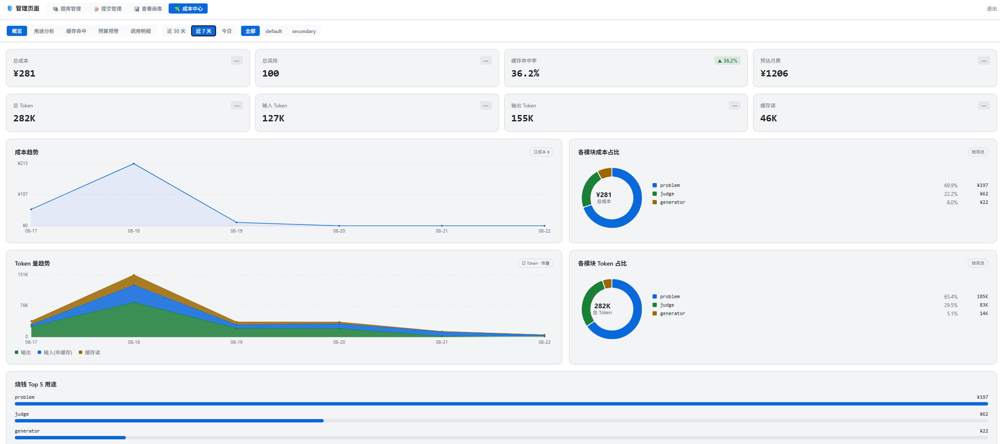 |

- **六维错误模式画像**：跨知识点的通病画像，覆盖 **正确性 & 边界 / 数据结构操作 / 复杂度 & 性能 / 算法思维 / 实现质量与鲁棒性 / 自测与调试** 共 6 个维度（`correctness / datastruct / perf / algo / impl / debug`）。由判题失败与轨迹分析双路 feeder 写入，时间衰减 + 叠加聚合，前端以纯 SVG **六维雷达图**呈现。
- **知识点画像（per-tag）**：35 个算法/数据结构 Tag，每个 Tag 维护熟练度 ELO / 稳定性 / 遗忘衰减 / 错误指纹 / 提交记录，规划 Agent 据此选题。
- **成本中心**：Token 用量与预算看板（调用 `/admin/token` 接口），可逐目的、逐模型、逐会话下钻。

---

## 技术栈

| 层 | 选型 | 理由 |
|---|---|---|
| 语言 | Python 3.12+ | LG 1.x / LC 1.x 锁 3.11+ |
| 包管理 | uv | 快，pyproject.toml 驱动 |
| Agent 编排 | LangGraph 1.x StateGraph + checkpointer + store | Loop / 状态持久化 / human-in-the-loop (interrupt) |
| LLM 调用 | langchain-openai + base_url  | OpenAI 兼容口，DeepSeek / 通义 / 自建都能走 |
| API 层 | FastAPI + uvicorn | /session /submit /chat /admin |
| 前端 | React 19 + Vite 6 + TypeScript | SPA，Monaco 编辑器，Tailwind 样式，纯 SVG 雷达图 |
| 判题沙箱 | Judge0（Docker）/ 本地 subprocess 兜底 | 资源隔离 + 用例执行 |
| 状态持久化 | langgraph-checkpoint-sqlite（会话级 checkpointer） | 单机会话恢复 |
| 长期记忆 | LG InMemoryStore → 中期 sqlite → 长期 RedisStore | 画像跨会话 |
| Observability | LangSmith | 多 Agent 没 trace 会疯 |
| 数据建模 | Pydantic v2 | LC/LG 原生 |

---

## 架构：出题 / 判题 / 辅导 / 规划 / 评审 + 轨迹分析

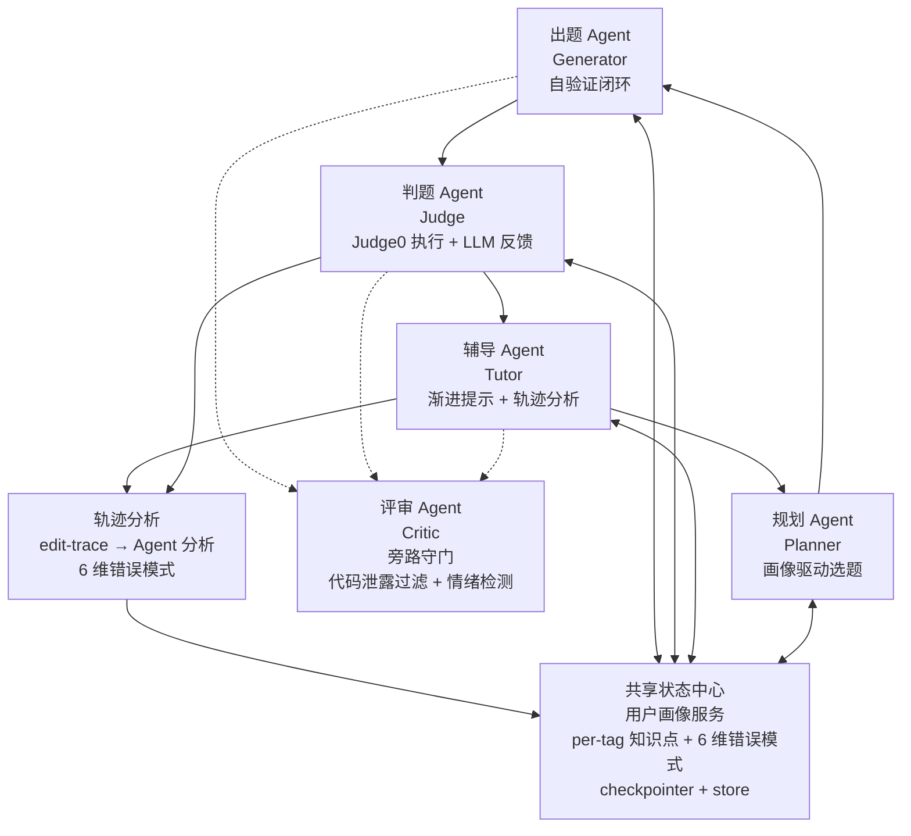

**调用契约（产品态）**：

- 规划 → 可下调出题（下发选题偏好）
- 判题 ↛ 辅导（只能**交棒**，由 LG 图的 conditional edge 走，不是函数调用）
- 评审 **无任何主动调用**，纯旁路监听 + 输出过滤
- 辅导 / 判题 结束后产出**画像增量（profile_delta）**与**错误模式增量（edit-trace 分析）**，统一由规划写入画像服务

> 详细设计文档见本地 `docs/` 目录（设计评审用，未纳入 git 追踪）。

---

## 开发进度

| 阶段 | 范围 | 状态 |
|---|---|---|
| 核心闭环 | 出题自验证 + 判题（Judge0 执行 + LLM 温暖反馈）+ 辅导 + 评审旁路守门 | ✅ 已实现 |
| 🔥 链路追踪辅导 | edit-trace 采集 + Agent 轨迹分析 / 复盘 + 导师同屏联动 | ✅ 已实现 |
| 用户画像 | per-tag 知识点画像（ELO / 稳定 / 遗忘）+ 6 维错误模式画像 + 智能选题 | ✅ 已实现 |
| 成本中心 | Token 用量 / 预算看板（按目的 / 模型 / 会话下钻） | ✅ 已实现 |
| Docker 部署 | Judge0 沙箱（按需启用）+ nginx 反向代理 | ✅ 已实现 |
| V0.5 | Debug 剧场 / 面试模拟 / 同伴对比 / 跨语言迁移 | ⏳ 规划中 |
| V1.0 | 全 PRD 功能 | ⏳ 规划中 |

---

## 项目结构

```
code-tutor-agent/
├── pyproject.toml
├── Makefile
├── .env.example
├── data/                   # 运行时数据（SQLite / checkpoints）
├── docker/                 # Docker / docker-compose 配置
│   ├── Dockerfile
│   ├── Dockerfile.frontend
│   ├── docker-compose.yml
│   ├── docker-compose.prod.yml
│   └── nginx-frontend.conf
├── scripts/               # 启动脚本（start-all.bat/.sh 等）与工具脚本
├── demo/                  # 系统功能截图（README 展示用）
├── src/
│   └── code_tutor_agent/
│       ├── api/           # FastAPI 入口（main.py + routers/）
│       │   ├── main.py        # app 装配 + /health
│       │   └── routers/       # session / chat / run / problems / admin / token
│       ├── db/            # 数据库模块（用户画像 / 轨迹 / 题目落库）
│       ├── graph/         # LangGraph StateGraph 定义
│       ├── nodes/         # Agent node 函数
│       │   ├── planner.py     # 规划（画像驱动选题）
│       │   ├── generator.py   # 出题（调用 generation 子 Agent）
│       │   ├── agent_judge.py # 判题（Judge0 执行 + LLM 温暖反馈）
│       │   ├── agent_tutor.py # 辅导路由（非 AC 循环等待重提交）
│       │   ├── critic.py      # 评审（旁路守门：代码泄露过滤 + 情绪检测）
│       │   ├── agent_dialog.py # 对话
│       │   └── wait_for_submit.py
│       ├── agents/        # LLM Agent 封装（dialog / judge / problem / tools）
│       ├── generation/    # 出题子流程（原创 LLM → 双解+示例 → verify → 跑参考解）
│       ├── profile/       # 用户画像
│       │   ├── schema.py      # 知识点画像（per-tag 5 字段）
│       │   ├── weakness.py    # 6 维错误模式画像（枚举 + 聚合）
│       │   ├── scoring.py     # ELO / 稳定 / 遗忘 打分纯函数
│       │   └── edit_trace_analyzer.py  # 轨迹 → 6 维错误模式增量
│       ├── trace/         # 编辑轨迹采集 / 预处理 / Agent 分析 / 复盘
│       ├── token_usage/   # Token 成本统计 / 预算 / 看板
│       ├── sandbox/       # 代码沙箱（runner / judge0_client / 结构转换）
│       ├── leetcode/      # LeetCode 同步 / 题源
│       ├── mcp/           # MCP 工具与服务
│       ├── store/         # 画像 / session 状态存取
│       ├── schemas/       # Pydantic State + Request/Response
│       ├── prompts/       # Prompt 模板
│       ├── models/        # 数据模型
│       ├── tools/         # 工具函数
│       ├── memory.py      # 记忆层
│       ├── context_manager.py  # 上下文管理
│       ├── progress.py    # 进度流（SSE）
│       ├── topics.py      # 知识点 / 标签（32 个 Tag）
│       └── config.py
├── frontend/              # React 19 + Vite 6 + TypeScript SPA
│   └── src/components/    # MainLayout / CodeEditor / AgentChat / AdminPanel(六维雷达) / CostCenter / 轨迹分析
├── tests/
└── docs/                  # 设计文档（本地评审用，未纳入 git 追踪）
```

---

## 快速开始

### 1. 安装

```bash
git clone https://github.com/YOUR_USERNAME/code-tutor-agent.git
cd code-tutor-agent
uv sync             # 安装后端 Python 依赖
cd frontend && npm install   # 安装前端 Node 依赖
cd ..
```

### 2. 环境变量

```bash
cp .env.example .env
# 编辑 .env 填入 API key
```

最小配置只需要一个 LLM 提供商（OpenAI 兼容 API）：

```ini
LLM_MODEL=gpt-4o
LLM_BASE_URL=https://api.openai.com/v1
LLM_API_KEY=«your-api-key»
```

支持任何 OpenAI 兼容的 API 提供商（DeepSeek、通义千问、SenseNova、Ollama 等）。
完整配置项见 [.env.example](.env.example)。

### 3. 启动服务

**方式 A：一键启动（前后端同时）**

```bash
# Windows (双击)
scripts\start-all.bat

# 或 git-bash
bash scripts/start-all.sh

# 或 Makefile (git-bash)
make all
```

**方式 B：分别启动（开发调试）**

```bash
# 终端 1 — 后端 (port 8765, hot-reload)
make server
# 或 uv run uvicorn src.code_tutor_agent.api.main:app --host 0.0.0.0 --port 8765 --reload

# 终端 2 — 前端 (port 5173, 自动代理 API)
make frontend
# 或 cd frontend && npm run dev
```

**方式 C：Docker**

```bash
# 开发模式 (hot-reload)
cp .env.example .env
docker compose -f docker/docker-compose.yml up -d

# 生产模式 (nginx 反向代理)
docker compose -f docker/docker-compose.yml -f docker/docker-compose.prod.yml up -d
```

### 4. API 端点

```
POST   /session                              → 新建 session，出题 + interrupt 返题面
POST   /session/{sid}/submit                 → 提交代码，走判题→辅导→下一轮
POST   /session/{sid}/next-problem           → 回导师对话；引导文案按上一题 verdict×提示深度建议换题方向（AC 且提示用得深→同类型巩固，WA 且提示深→换方向/降难度）
GET    /session/{sid}/state                  → 前端轮询渲染
POST   /session/{sid}/chat/stream            → 导师对话（流式）
POST   /session/{sid}/edit-trace             → 上报编辑轨迹（edit/idle/run/submit 四类事件）
POST   /session/{sid}/analyze                → 触发轨迹分析
GET    /session/{sid}/analysis               → 获取轨迹分析结果
POST   /session/{sid}/analyze/summarize     → 生成会话复盘摘要
POST   /session/{sid}/run                    → 仅运行代码不判题
GET    /problems                             → 题目列表
GET    /problems/topics                      → 知识点 / 标签
POST   /admin/login                          → 管理端登录
GET    /admin/profile                        → 用户画像（旧版）
GET    /admin/profile/v2                     → 用户画像（新版 per-tag）
POST   /admin/token/overview                 → 成本中心看板数据
GET    /health                               → 健康检查
```

---

## Docker 部署

### 快速开始（开发模式）

```bash
# 1. 复制环境变量模板，编辑只填大模型配置即可
cp .env.example .env

# 2. 一键启动（前后端 + Judge0 判题沙箱）
#    Judge0、Redis、CORS 等变量已在 .env.example 提供默认值，无需手动配置
docker compose -f docker/docker-compose.yml up -d --build

# 3. 验证
curl http://localhost:8765/health
# 前端访问 http://localhost:3000
```

### 生产模式（nginx 反向代理）

```bash
docker compose -f docker/docker-compose.yml -f docker/docker-compose.prod.yml up -d --build
# 前端 http://localhost:3000（nginx 代理所有 API 路由到后端）
```

### 环境变量说明

| 变量 | 必需 | 默认值 | 说明 |
|---|---|---|---|
| `LLM_MODEL` | 是 | — | LLM 模型名（OpenAI 兼容） |
| `LLM_BASE_URL` | 是 | — | LLM API 基础 URL |
| `LLM_API_KEY` | 是 | — | LLM API 密钥 |
| `JUDGE0_URL` | 否 | `http://localhost:2358` | Judge0 沙箱地址（设为 `http://judge0:2358` 由 compose 自动注入） |
| `JUDGE_BACKEND` | 否 | `self` | 判题后端切换：`self`（本地 subprocess）/ `judge0` |
| `CORS_ORIGINS` | 否 | `http://localhost:3000,...` | 前端跨域来源 |
| `VITE_API_BASE` | 否 | `http://localhost:8765` | 前端 API 基础 URL（构建时注入；生产模式设为 `/` 走同源代理） |

### 容器结构

- **backend**：FastAPI + uvicorn，端口 8765，挂载 `src/`（开发模式热重载）和 `data/`（持久化）
- **frontend**：Nginx 静态服务，端口 3000，代理 `/session/`、`/problems`、`/admin/`、`/health` 到后端（SSE 路径关闭缓冲）
- **judge0**：判题沙箱，含 PostgreSQL + Redis，需要 `privileged` 模式

### 移除 skill-engine

`skill-engine`（本地 Python 包）已从项目依赖中移除。详细题解功能改由导师 LLM 直接生成简单题解，无需额外安装。如需恢复 skill-engine 集成，请参考独立仓库 `skill-engine` 手动安装。

### LangSmith Trace

跑起来后 LangSmith 控制台能看到每条 session 全链路：
`generator(自修几轮) → judge(执行+反馈) → tutor(提示等级决策) → critic(核准) → trace(轨迹分析)`
换题（`/next-problem`）时 critic 的 ABANDON 分支清题进入对话，引导文案复用 `problem_history[-1]` 的 `verdict` + `hint_level_reached`（提示深度，≥3 视为掌握不牢）按规则建议换题方向。

---

## 核心设计决策

### 判题：执行与反馈分离，verdict 客观唯一

- 判题由 **Judge0 沙箱客观执行**全量用例，verdict（AC / WA / RE / TLE）由执行引擎结果归约得出，**绝不交给 LLM 主观判断**。
- LLM 只负责生成温暖、面试导向的反馈文案与修复建议，且被强制注入权威 verdict，禁止自行改判或臆造失败用例的"实际输出"。
- AC 时仍做时空复杂度分析与优化方向提示（如暴力解可改哈希表）。

### 🔥 链路追踪辅导：edit-trace 即"教学可观测性"

- 辅导 Agent 不只看最终代码，而是消费**全量编辑轨迹（edit-trace）**：每次键入(edit)/停顿(idle)/运行(run)/提交(submit) 四类结构化事件都入轨（`POST /session/{sid}/edit-trace`），由 `trace/` 模块做预处理 + Agent 轨迹分析（`/analyze` → `/analysis` → `/analyze/summarize`）。
- 轨迹分析反推**真实思考路径与卡点**：是"不会用哈希表"还是"知道但写不对 dict"，从行为而非结果判定，避免误判。
- **同屏联动**：导师辅导界面与轨迹分析并排展示，提示等级（L0~L4）结合轨迹证据与提示依赖度动态推进，而非凭空给。
- 这是把"为什么教不会"从玄学变成**可观测、可复盘数据**的核心——也是区别于一切 OJ / 答题器的关键能力。

### 双画像体系：知识点画像 × 错误模式画像

- **知识点画像（per-tag）**：35 个算法/数据结构 Tag，每个 Tag 维护 `prof`（ELO 熟练度 1000~4000）、`stab`（稳定性滑动窗 + 方差）、`forget`（遗忘衰减）、`errors`（错误指纹）、`attempts`（提交记录）。规划 Agent 据此选"最弱 tag"出题。
- **6 维错误模式画像（weakness）**：跨知识点的通病，维度为 `correctness / datastruct / perf / algo / impl / debug`。由**判题失败提取** + **轨迹分析**双路 feeder 写入，采用时间衰减 + 叠加聚合（久不犯自然淡出），LLM 输出被约束到固化 slug 防幻觉。前端以纯 SVG **六维雷达图**展示。

### checkpointer vs store（LG 1.x 两件套别混）

- `checkpointer`（sqlite）：per-session，thread_id 绑，LG 原生恢复 State
- `store`（InMemoryStore → RedisStore）：cross-session，用户画像，LG `store.list/put/get` 接口统一，后期换 Redis 零改动

### 评审约束（旁路守门，非集中式宪法引擎）

评审 Agent 以旁路方式监听辅导输出，不做一票打回，仅落两类硬约束：

- **代码泄露过滤（post-guard）**：低提示等级（< 4）下若辅导消息包含完整代码块，正则拦截并替换为占位提示，强制苏格拉底式引导，不直接给答案（`critic.py` 的 `R01_CODE_LEAK_PATTERNS` + `prompts/tutor.py` 的 prompt 层约束）。
- **代写 / 答案泄露拦截**：prompt 层约束辅导 Agent 拒绝代写与直接给答案；关键词命中即拦截（`prompts/tutor.py` 的 `R10_CODE_WRITE_PATTERNS` / `R01_ANSWER_LEAK_PATTERNS`）。
- **挫败情绪检测**：识别用户放弃 / 急躁信号（`R04_FRUSTRATION_KEYWORDS`），供辅导策略切换（安抚 + 放宽到 L4）。

此外出题侧有独立的题目新颖性评审（`prompts/generate_problem.py` 的 `CRITIC_NOVELTY_SYSTEM`）。

---

## Roadmap（详细）

详细的炸场功能优先级与设计文档见本地 `docs/` 目录（设计评审用，未纳入 git 追踪）。

> 简历向一句话标题：
> **CodeTutor-Agent: A Self-Verifying, Long-Term Adaptive Coding Mentor with Multi-Agent Collaboration and Edit-Trace Observability**

---

## License

本项目以 [MIT License](LICENSE) 开源。详见 [LICENSE](LICENSE) 文件。

---

## Author

Andre

> ⚠️ 项目处于活跃开发阶段。API / State schema / Agent 拓扑仍可能演进，但核心闭环（出题 → 判题 → 辅导 → 轨迹分析 → 规划出题）已可端到端跑通。
