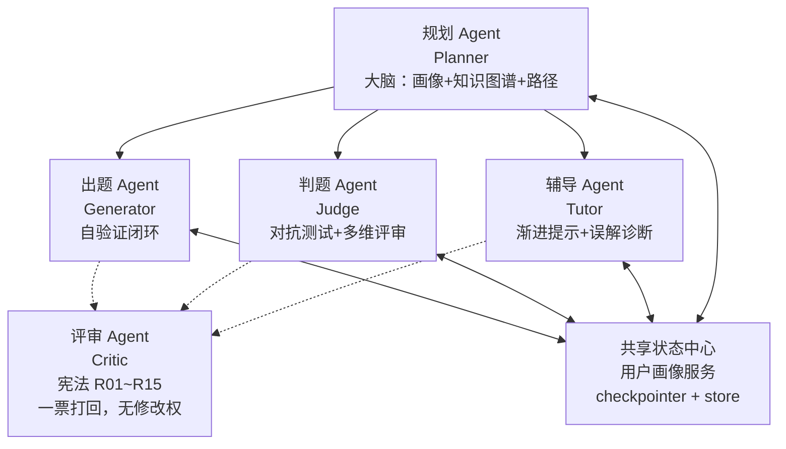

# CodeTutor Agent

> AI 编程导师，不是 OJ。
> 具备"自主出题 → 对抗判题 → 渐进辅导 → 长期规划"完整认知循环的 **Agent 级**刷题系统。

!https://img.shields.io/badge/Python-3.12-blue !https://img.shields.io/badge/LangGraph-1.x-orange !https://img.shields.io/badge/LangChain-1.3-green !https://img.shields.io/badge/license-MIT-blue

---

## 为什么不是又一个 LeetCode Clone

传统 OJ 的逻辑是线性的：`用户提交 → 跑用例 → 对答案 → 结束`。
CodeTutor Agent 的逻辑是 **ReAct Loop**：`思考 → 行动 → 观察 → 反思 → 再思考`。

几个真正"Agent 级"的差异点：

- **出题 Agent 自验证闭环**：题是自己出的，参考解是自己写的，测试用例是自己跑的——发现自己参考解跑不过 #17 用例，回去修题目描述歧义，再跑，全绿才交付。**盲信 LLM 的反面。**
- **判题 Agent 对抗测试**：用户代码 AC 基础用例不算完，Agent 会主动生成 10⁵ 规模对抗用例搞挂暴力解，然后告诉你"考虑 O(n log n)"。**主动博弈，不是被动执行。**
- **辅导 Agent 渐进提示 + 误解诊断**：不是 "WA at #3"，是根据用户 diff + 情绪 + 错误模式动态给 L0~L4，能反推"这哥们是不知道哈希表，还是知道但不会写 dict"。
- **规划 Agent 长期画像**：跨会话维护「熟练度 / 稳定性 / 遗忘天数 / 常见错误」5 维画像，下一题不是随机出，是按心流区间算的。
- **评审 Agent 宪法守门**：R01~R15 宪法规则（教学克制 / 抄袭零容忍 / 情绪熔断），一票打回权，无修改权。

---

## 技术栈

| 层 | 选型 | 理由 |
|---|---|---|
| 语言 | Python 3.12 | LG 1.x / LC 1.x 锁 3.11+ |
| 包管理 | uv | 快，pyproject.toml 驱动 |
| Agent 编排 | LangGraph 1.x StateGraph + checkpointer + store | Loop / 状态持久化 / human-in-the-loop (interrupt) |
| LLM 调用 | langchain-openai + base_url 偷梁换柱 | OpenAI 兼容口，DeepSeek / 通义 / 自建都能走 |
| API 层 | FastAPI + uvicorn | /session /submit /chat |
| 判题沙箱 (MVP) | subprocess + resource.RLIMIT_* + psutil | Unix 资源限，V3 换 Docker/gVisor |
| 状态持久化 | langgraph-checkpoint-sqlite（会话级 checkpointer） | MVP 单机 |
| 长期记忆 | LG InMemoryStore → 中期 sqlite → 长期 RedisStore | 画像 5 维跨会话 |
| Observability | LangSmith | 五 Agent 没 trace 会疯 |
| 数据建模 | Pydantic v2 | LC/LG 原生 |

---

## 架构：五 Agent + 评审宪法



**调用契约（产品态）**：

- 规划 → 可下调出题/判题/辅导（下发指令）
- 判题 ↛ 辅导（只能**交棒**，由 LG 图的 conditional edge 走，不是函数调用）
- 评审 **无任何主动调用**，纯旁路监听 + 打回

> 详细参见 PRD §八《Agent 协作契约》。

---

## 开发进度

| 阶段 | 范围 | 状态 |
|---|---|---|
| MVP (V0.1) | 出题自验证 + 判题对抗 + 辅导 L0~L4 + 硬编码规划 + prompt-guard 评审 | 🚧 开发中 |
| V0.2 | 评审 Agent 真·node（R06~R15 含抄袭识别 R12） | ⏳ |
| V0.3 | 规划 Agent LLM 化 + 知识图谱 + 心流校准 | ⏳ |
| V0.4 | 沙箱 Docker/gVisor + RedisStore 画像 | ⏳ |
| V0.5 | Debug 剧场 / 面试模拟 / 同伴对比 / 跨语言迁移 | ⏳ |
| V1.0 | 全 PRD 功能 | ⏳ |

---

## 项目结构

```
code-tutor-agent/
├── pyproject.toml
├── Makefile
├── .env.example
├── data/                   # 运行时数据
│   ├── db/                 #   SQLite 数据文件
│   └── checkpoints/        #   LangGraph checkpointer
├── docker/                 # Docker / docker-compose 配置
│   ├── Dockerfile
│   ├── Dockerfile.frontend
│   ├── docker-compose.yml
│   ├── docker-compose.prod.yml
│   └── nginx-frontend.conf
├── scripts/               # Windows .bat / Unix .sh 启动脚本
├── src/
│   └── code_tutor_agent/
│       ├── api/           # FastAPI 入口（/session /submit /chat）
│       ├── db/            # 数据库模块
│       ├── graph/         # LangGraph StateGraph 定义
│       ├── nodes/         # 五大 Agent node 函数
│       │   ├── planner.py    # 规划（MVP: hardcode 规则）
│       │   ├── generator.py  # 出题 + 自验证闭环
│       │   ├── judge.py      # 判题 + 对抗三分法
│       │   ├── tutor.py      # 辅导 + L0~L4
│       │   └── critic.py     # 评审（MVP: prompt guard → V0.2 真·node）
│       ├── schemas/       # Pydantic State + Request/Response
│       ├── sandbox/       # 代码沙箱（MVP: subprocess）
│       └── store/         # 画像 / session 状态存取
├── tests/
└── docs/
    └── PRD_v1.1.md        # 产品需求文档（含 §八 契约层）
```

---

## 快速开始

### 1. 安装

```bash
git clone https://github.com/YOUR_USERNAME/code-tutor-agent.git
cd code-tutor-agent
uv sync             # 安装后端 Python 依赖
cd frontend && npm install   # 安装前端 Node 依赖（可选）
cd ..
```

### 2. 环境变量

```bash
cp .env.example .env
# 编辑 .env 填入 API key
```

最小配置只需要一个 LLM 提供商（OpenAI 兼容 API）：

```ini
LLM_MODEL=gpt-4o
LLM_BASE_URL=https://api.openai.com/v1
LLM_API_KEY=sk-your-api-key
```

支持任何 OpenAI 兼容的 API 提供商（DeepSeek、通义千问、SenseNova、Ollama 等）。
完整配置项见 [.env.example](.env.example)。

### 3. 启动服务

**方式 A：一键启动（前后端同时）**

```bash
# Windows (双击)
scripts\start-all.bat

# 或 git-bash
bash scripts/start-all.sh

# 或 Makefile (git-bash)
make all
```

**方式 B：分别启动（开发调试）**

```bash
# 终端 1 — 后端 (port 8765, hot-reload)
make server
# 或 uv run code-tutor-api

# 终端 2 — 前端 (port 5173, 自动代理 API)
make frontend
# 或 cd frontend && npm run dev
```

**方式 C：CLI 交互模式（纯后端）**

```bash
uv run code-tutor
# 或 make cli
```

**方式 D：Docker**

```bash
# 开发模式 (hot-reload)
cp .env.example .env
docker compose -f docker/docker-compose.yml up -d

# 生产模式 (nginx + 多副本)
docker compose -f docker/docker-compose.yml -f docker/docker-compose.prod.yml up -d
```

### 4. API 端点

```
POST /session              → 新建 session，跑到第一题出题 + interrupt 返题面
POST /session/{sid}/submit {code, language} → 提交代码，走判题→辅导→下一轮
GET  /session/{sid}/state  → 前端轮询渲染
GET  /health               → 健康检查
```

### 5. LangSmith Trace

跑起来后 LangSmith 控制台能看到每条 session 全链路：
`generator(自修几轮) → judge(基础+对抗) → tutor(提示等级决策) → critic(核准)`

---

## 核心设计决策

### 对抗三分法（规模 / 边界 / 精度）

- **规模对抗** = LLM 出"分布特征" + 规则拼数组（成本 vs 覆盖的 trade-off，纯 LLM 贵 30% 废用例，纯规则易被 early exit 骗）
- **边界 / 精度** = 纯规则（确定性高，不必 LLM）

### checkpointer vs store（LG 1.x 两件套别混）

- `checkpointer`（sqlite）：per-session，thread_id 绑，LG 原生恢复 State
- `store`（InMemoryStore → RedisStore）：cross-session，用户画像 5 维，LG `store.list/put/get` 接口统一，后期换 Redis 零改动

### 宪法引擎 = 分层混合，不 DSL 不纯 LLM

- R04/R05/R10 → rule（硬、快、防 jailbreak）
- R09 → rule 关键词先拦 + LLM 核准语境
- R01/R11 → LLM + few-shot（语义判断）

---

## Roadmap（详细）

参见 `docs/PRD_v1.1.md` §七 炸场功能优先级 + 上方"开发进度"表。

> 简历向一句话标题：
> **CodeTutor-Agent: A Self-Verifying, Adversarial, Long-Term Adaptive Coding Mentor with Multi-Agent Collaboration**

---

## Author

YOUR_NAME / YOUR_CONTACT

---

> ⚠️ 项目早期，API / State schema / Agent 拓扑都可能变。MVP 目标：一条完整 session 能跑通「出题自验证 → 用户写暴力 → WA → 辅导 L1 → 改 → AC → 对抗 TLE → 辅导 L3 → 哈希改 → AC+对抗过 → 规划出下一题」。