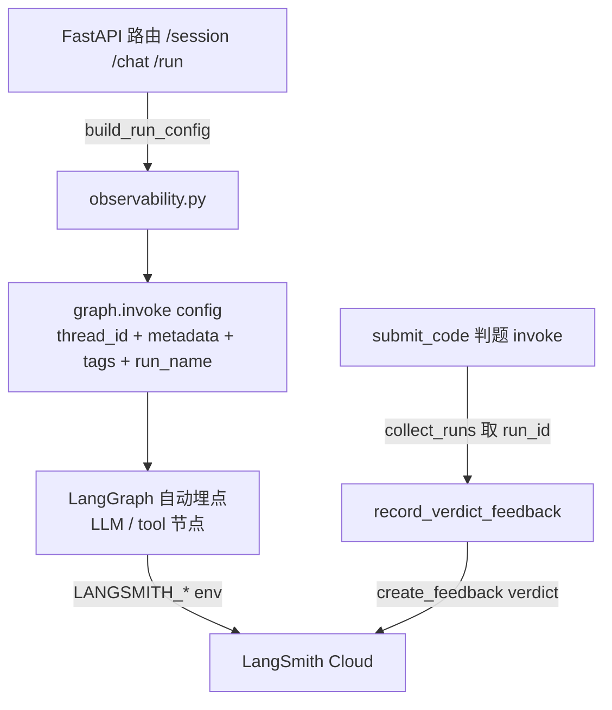

# LangSmith 接入方案（code-tutor-agent）

> 分支：`master`（已于 `75316f8` 合入主干，接入为非侵入式可观测层）
> 目标：在不改动现有出题/判题/对话主流程的前提下，增加一套**非侵入式可观测层**。
> 范围（已与用户确认）：**全套 = 基础自动追踪 + 会话级元数据/标签 + 判题结果反馈打分**；环境变量迁移到新名 `LANGSMITH_*`（保留旧名兼容）。

---

## 1. 背景与价值

当前项目所有 LLM 调用统一走 `src/code_tutor_agent/config.py` 的 `get_llm()`（基于 `init_chat_model`），整体使用 **LangChain 1.x + LangGraph 1.x**。

这套栈对 LangSmith 是**原生自动埋点**：只要设置好环境变量，所有 LLM 调用、graph 节点、tool 调用都会异步上报，**不需要改任何业务调用代码**。

接入后可获得：

| 能力 | 用途 |
|------|------|
| 全链路追踪 | 在 LangSmith 看板查看每次出题/判题/对话的完整调用树（LLM、graph 节点、tool） |
| 会话级打标 | 按 `session_id` / `mode`(agent/normal) / `topic` / `difficulty` / `problem_id` 维度筛选 trace |
| 判题反馈打分 | 把客观 `verdict`（AC/WA/RE/TLE）作为 feedback 回传，支撑后续数据集评估与回归 |

---

## 2. 成本与免费额度（个人项目够用）

- LangSmith **Developer 免费档**：每月 **5,000 traces**，14 天数据保留，1 seat。
- **计费单位说明**：一次 `graph.invoke`（出题/判题/对话）算 **1 条 trace**；其内部嵌套的多次 LLM 调用是子 run，**不单独占 trace 额度**。
- 反馈打分（`create_feedback`）只是给已有 run 贴标签，**不创建新 trace、不触发额外 LLM 调用**，几乎零成本。
- 个人项目月用量（数百次）远低于 5K 上限。
- **不配 key = 零成本零 trace**，整个接入可一键关闭。

---

## 3. 架构与数据流



- 基础追踪：LangChain/LangGraph 回调机制**异步批量**上报，不影响请求延迟。
- 反馈打分：在 submit 判题的 `graph.invoke` 外包 `collect_runs()` 取 run_id，再回传 feedback。

---

## 4. 环境变量迁移

模板与代码统一使用 ``LANGSMITH_*`` 新名（不再识别旧 ``LANGCHAIN_*``）。

| 变量 | 说明 |
|------|------|
| `LANGSMITH_TRACING=true` | 显式开启追踪 |
| `LANGSMITH_API_KEY=...` | 追踪开关与身份 |
| `LANGSMITH_PROJECT=...` | 项目名，便于隔离 |

> 注：LangSmith 在检测到 `LANGSMITH_API_KEY` 后会自动开启追踪，`LANGSMITH_TRACING=true` 用于显式强制。
> 新增可选开关 `LANGSMITH_FEEDBACK`（默认 true），用于单独关闭反馈打分。

---

## 5. 核心模块：`src/code_tutor_agent/observability.py`

集中式辅助模块，封装三件事，所有调用点复用，降低回归风险：

```python
def is_tracing_enabled() -> bool:
    """检测 LANGSMITH_API_KEY 是否存在。"""

def build_run_config(
    sid: str,
    *,
    mode: str | None = None,
    topic: str | None = None,
    difficulty: str | None = None,
    problem_id: int | None = None,
    run_name: str | None = None,
) -> dict:
    """
    返回带 configurable/metadata/tags/run_name 的 graph.invoke config。
    无 key 时仍返回含 thread_id 的 config，但不上报。
    """

def record_verdict_feedback(
    run_id: str,
    verdict: str,
    *,
    session_id: str | None = None,
    hint_level: int | None = None,
    judge_cycle: int | None = None,
) -> None:
    """把客观 verdict 映射为 score（AC=1，其余=0）回传 feedback，全程非致命。"""
```

设计要点：
- **模块加载时**打印 tracing 启用状态（INFO 级，含 project 名），便于启动期确认接线。
- **`build_run_config`** 在现有 `{"configurable": {"thread_id": sid}}` 基础上追加 `metadata` / `tags` / `run_name`，**不影响 checkpointer 与续跑逻辑**。
- **`record_verdict_feedback`** 全部包在 `try/except` 内；网络失败仅记日志，不影响返回。
- **无 key 早退**：所有函数无 key 时零开销、零副作用。

---

## 6. 接入点清单

| 文件 | 改动 |
|------|------|
| `pyproject.toml` | 显式添加 `langsmith>=0.3.0`（当前仅为传递依赖） |
| `.env.template` | 改用 `LANGSMITH_TRACING/API_KEY/PROJECT`，保留旧名说明 |
| `.env`（真实） | **仅追加**缺失的 `LANGSMITH_*` 键，绝不覆盖已有密钥 |
| `src/code_tutor_agent/observability.py` | **新建**，集中式辅助模块 |
| `src/code_tutor_agent/api/services/generation.py` | `run_generation` 等约 3 处 `graph.invoke` 改用 `build_run_config` |
| `src/code_tutor_agent/api/routers/session.py` | 约 7 处 config 改用 `build_run_config`；`submit_code` 用 `collect_runs` 捕获 run_id 并回传 verdict feedback |
| `src/code_tutor_agent/api/routers/chat.py` | 约 3 处 config 改用 `build_run_config`；agent 提交/出题后台 invoke 处回传 feedback |
| `src/code_tutor_agent/api/routers/run.py` | config 改用 `build_run_config` |

> 元数据注入只是「加字段」，把原 `config = {"configurable": {"thread_id": sid}}` 替换为 `build_run_config(sid, mode=..., topic=..., difficulty=..., problem_id=..., run_name=...)`。

---

## 7. 反馈打分设计（verdict → score）

- `collect_runs()` 包住 submit 判题的 `graph.invoke(Command(resume=...), config)`，取 `runs[-1].id` 作为 run_id；`run_name` 固定为 `"judge_submit"` 便于检索。
- verdict → score 映射：`AC → 1`，`WA/RE/TLE → 0`（verdict 来自既有的 `_deterministic_verdict` / `_collapse_verdict` 客观归约，**反馈逻辑绝不改动判题确定性**）。
- feedback 字段：
  - `verdict_score`（0/1）
  - `verdict`（字符串）
  - `hint_level`（用户已使用的提示层级，可选）
  - `judge_cycle`（第几次提交，可选）
  - comment 带上 `session_id` 便于关联。
- 该结构可被 LangSmith 的 evaluation / datasets 流程消费，支撑后续 A/B、回归与质量监控。

---

## 8. 安全性与降级（非侵入保证）

1. **配了 key 才追踪**：`is_tracing_enabled()` 检测不到 key → tracing 不启动、feedback 静默跳过，主流程行为与现在完全一致。
2. **反馈旁路化**：feedback 网络失败被吞掉，submit 照常返回。
3. **不改判题逻辑**：verdict 仍由现有确定性函数产生，feedback 只是「抄送」结果。
4. **单一命名**：仅识别 `LANGSMITH_*` 新名；真实 `.env` 只追加不覆盖。

---

## 9. 实施步骤（TODO）

1. `langsmith` 依赖 + 环境变量（pyproject / .env.template / .env）
2. 新建 `observability.py`（tracing 开关 / `build_run_config` / `record_verdict_feedback`）
3. 在 generation / session / chat / run 的 `graph.invoke` 注入会话元数据与标签
4. submit 与 agent 提交处用 `collect_runs` 捕 run_id 并回传 verdict feedback
5. 更新 README/docs 并验证「配 key 追踪 / 无 key 降级」

---

## 10. 验证方法

- **配 key 路径**：设置 `LANGSMITH_API_KEY` 后启动，发起一次出题/提交，在 LangSmith 看板确认出现 trace 且带 `session_id`/`mode` 元数据；提交后该 trace 上出现 `verdict_score` feedback。
- **无 key 路径**： unset key 启动，确认启动日志显示「tracing disabled」，出题/判题/对话功能与日志与接入前一致，无报错、无网络请求。
- **真实 `.env` 现状**：本仓 `.env` 当前**未配置**任何 LangSmith 键（追踪默认关闭）。为保持现有部署不变，`.env` 中 `LANGSMITH_*` 以**注释形式**追加（见文件末尾）；启用时只需取消注释并填入真实 `LANGSMITH_API_KEY` 即可，无需改动代码。
- **回归**：现有测试套件（出题/判题/对话）全部通过，判题 verdict 不变。

---

## 11. 后续：LangSmith Evaluation 用法（可选）

当积累了一定数量的 verdict feedback 后，可用 LangSmith 的 datasets + evaluation 做：
- 改动 prompt / 出题策略前后的 AC 率对比（回归）；
- 按 `topic` / `difficulty` 维度看判题质量分布；
- 导出数据集做离线批量评估。
